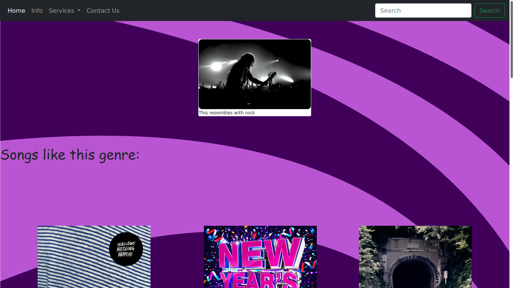
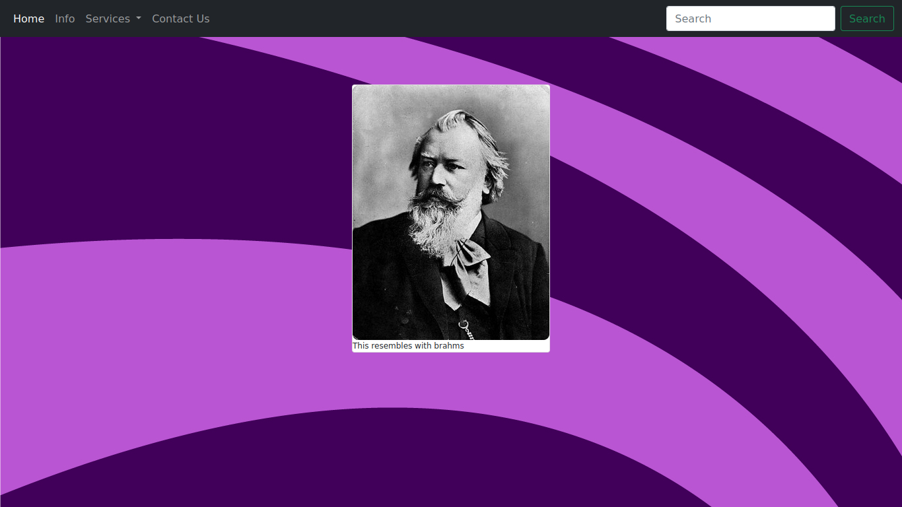

# Musically Genre and Composer Predictor

This webapp made on django can predict genre of an uploaded song and also has the functionality of predicting composer of classical songs.It has also the integration of Spotify in it
and a backend as well for authentication and feedback purposes.

Dependencies include:
<ul>
<li>Tensorflow</li>
<li>Sklearn</li>
<li>Spotipy</li>
<li>Django</li>
<li>librosa</li>
<li>pickle</li>
<li>numpy</li>
</ul>

Results for genre prediction
 

  
Results for classical composer prediction
 

The app is now predicting based on the song and the more difficult work done on it are the models itself I will add more functionality to it like a discussion board that people can express there views on.